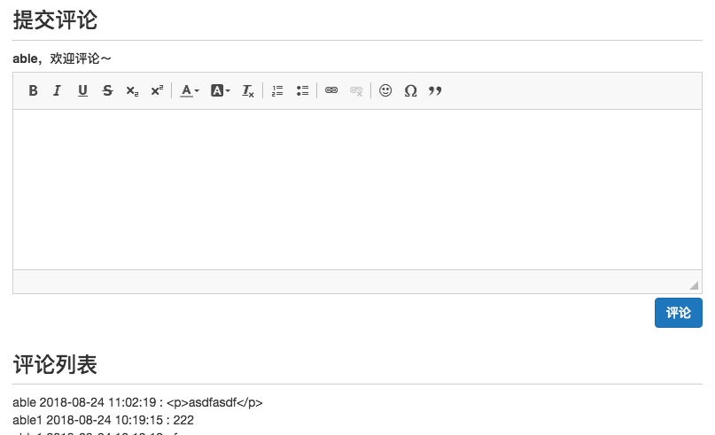
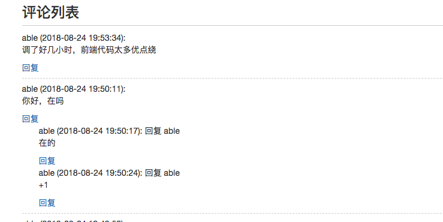

# Django_Course

Python Django Web开发  入门到实践 视频地址：<https://space.bilibili.com/252028233/>

看视频整理要点笔记:

- [Django_Course](#djangocourse)
    - [01.什么是Django](#01%E4%BB%80%E4%B9%88%E6%98%AFdjango)
        - [1. 什么是Django](#1-%E4%BB%80%E4%B9%88%E6%98%AFdjango)
        - [2. Django版本选择](#2-django%E7%89%88%E6%9C%AC%E9%80%89%E6%8B%A9)
    - [02.入门 Hello World](#02%E5%85%A5%E9%97%A8-hello-world)
    - [03.Django基本应用结构](#03django%E5%9F%BA%E6%9C%AC%E5%BA%94%E7%94%A8%E7%BB%93%E6%9E%84)
    - [04.使用模版显示内容](#04%E4%BD%BF%E7%94%A8%E6%A8%A1%E7%89%88%E6%98%BE%E7%A4%BA%E5%86%85%E5%AE%B9)
    - [05.定制后台和修改模型](#05%E5%AE%9A%E5%88%B6%E5%90%8E%E5%8F%B0%E5%92%8C%E4%BF%AE%E6%94%B9%E6%A8%A1%E5%9E%8B)
    - [06.开始完整制作网站](#06%E5%BC%80%E5%A7%8B%E5%AE%8C%E6%95%B4%E5%88%B6%E4%BD%9C%E7%BD%91%E7%AB%99)
    - [07.构建个人博客网站](#07%E6%9E%84%E5%BB%BA%E4%B8%AA%E4%BA%BA%E5%8D%9A%E5%AE%A2%E7%BD%91%E7%AB%99)
    - [08.常用的模版标签和过滤器](#08%E5%B8%B8%E7%94%A8%E7%9A%84%E6%A8%A1%E7%89%88%E6%A0%87%E7%AD%BE%E5%92%8C%E8%BF%87%E6%BB%A4%E5%99%A8)
    - [09.模版嵌套](#09%E6%A8%A1%E7%89%88%E5%B5%8C%E5%A5%97)
    - [10.使用CSS美化页面](#10%E4%BD%BF%E7%94%A8css%E7%BE%8E%E5%8C%96%E9%A1%B5%E9%9D%A2)
    - [11.CSS框架协助前端布局](#11css%E6%A1%86%E6%9E%B6%E5%8D%8F%E5%8A%A9%E5%89%8D%E7%AB%AF%E5%B8%83%E5%B1%80)
    - [12.Bootstrap响应式布局](#12bootstrap%E5%93%8D%E5%BA%94%E5%BC%8F%E5%B8%83%E5%B1%80)
    - [13.分页和shell命令行模式](#13%E5%88%86%E9%A1%B5%E5%92%8Cshell%E5%91%BD%E4%BB%A4%E8%A1%8C%E6%A8%A1%E5%BC%8F)
    - [14.优化分页展示](#14%E4%BC%98%E5%8C%96%E5%88%86%E9%A1%B5%E5%B1%95%E7%A4%BA)
    - [15.上下篇博客和按月分类](#15%E4%B8%8A%E4%B8%8B%E7%AF%87%E5%8D%9A%E5%AE%A2%E5%92%8C%E6%8C%89%E6%9C%88%E5%88%86%E7%B1%BB)
    - [16.统计分类博客的数量](#16%E7%BB%9F%E8%AE%A1%E5%88%86%E7%B1%BB%E5%8D%9A%E5%AE%A2%E7%9A%84%E6%95%B0%E9%87%8F)
    - [17.博客后台富文本编辑](#17%E5%8D%9A%E5%AE%A2%E5%90%8E%E5%8F%B0%E5%AF%8C%E6%96%87%E6%9C%AC%E7%BC%96%E8%BE%91)
    - [18.博客阅读简单计数](#18%E5%8D%9A%E5%AE%A2%E9%98%85%E8%AF%BB%E7%AE%80%E5%8D%95%E8%AE%A1%E6%95%B0)
    - [19.博客阅读计数优化](#19%E5%8D%9A%E5%AE%A2%E9%98%85%E8%AF%BB%E8%AE%A1%E6%95%B0%E4%BC%98%E5%8C%96)
        - [方法一](#%E6%96%B9%E6%B3%95%E4%B8%80)
        - [方法二](#%E6%96%B9%E6%B3%95%E4%BA%8C)
    - [20.阅读计数统计和显示](#20%E9%98%85%E8%AF%BB%E8%AE%A1%E6%95%B0%E7%BB%9F%E8%AE%A1%E5%92%8C%E6%98%BE%E7%A4%BA)
    - [21.热门阅读博客排行及缓存提速](#21%E7%83%AD%E9%97%A8%E9%98%85%E8%AF%BB%E5%8D%9A%E5%AE%A2%E6%8E%92%E8%A1%8C%E5%8F%8A%E7%BC%93%E5%AD%98%E6%8F%90%E9%80%9F)
    - [22.评论功能设计和用户登录](#22%E8%AF%84%E8%AE%BA%E5%8A%9F%E8%83%BD%E8%AE%BE%E8%AE%A1%E5%92%8C%E7%94%A8%E6%88%B7%E7%99%BB%E5%BD%95)
    - [23.html表单提交评论](#23html%E8%A1%A8%E5%8D%95%E6%8F%90%E4%BA%A4%E8%AF%84%E8%AE%BA)
    - [24.使用Django Form表单](#24%E4%BD%BF%E7%94%A8django-form%E8%A1%A8%E5%8D%95)
    - [25.表单富文本编辑和ajax异步提交评论](#25%E8%A1%A8%E5%8D%95%E5%AF%8C%E6%96%87%E6%9C%AC%E7%BC%96%E8%BE%91%E5%92%8Cajax%E5%BC%82%E6%AD%A5%E6%8F%90%E4%BA%A4%E8%AF%84%E8%AE%BA)
    - [26.回复功能设计和树结构](#26%E5%9B%9E%E5%A4%8D%E5%8A%9F%E8%83%BD%E8%AE%BE%E8%AE%A1%E5%92%8C%E6%A0%91%E7%BB%93%E6%9E%84)
    - [27.获取评论数和细节处理](#27%E8%8E%B7%E5%8F%96%E8%AF%84%E8%AE%BA%E6%95%B0%E5%92%8C%E7%BB%86%E8%8A%82%E5%A4%84%E7%90%86)
    - [28.实现点赞功能, 看似简单，内容很多](#28%E5%AE%9E%E7%8E%B0%E7%82%B9%E8%B5%9E%E5%8A%9F%E8%83%BD-%E7%9C%8B%E4%BC%BC%E7%AE%80%E5%8D%95%E5%86%85%E5%AE%B9%E5%BE%88%E5%A4%9A)
    - [29.完善点赞功能](#29%E5%AE%8C%E5%96%84%E7%82%B9%E8%B5%9E%E5%8A%9F%E8%83%BD)
    - [30.导航栏添加用户操作](#30%E5%AF%BC%E8%88%AA%E6%A0%8F%E6%B7%BB%E5%8A%A0%E7%94%A8%E6%88%B7%E6%93%8D%E4%BD%9C)
    - [31.自定义用户模型](#31%E8%87%AA%E5%AE%9A%E4%B9%89%E7%94%A8%E6%88%B7%E6%A8%A1%E5%9E%8B)
    - [32.修改用户信息](#32%E4%BF%AE%E6%94%B9%E7%94%A8%E6%88%B7%E4%BF%A1%E6%81%AF)

## 01.什么是Django

### 1. 什么是Django

- 官网：<https://www.djangoproject.com>
- 文档：<https://docs.djangoproject.com/en/2.0/>
- The web framework for perfectionists with deadlines.
- 在截止日期内，完美主义者使用的Web框架。
- Django was invented to meet fast-moving newsroom deadlines, while satisfying the tough requirements of experienced Web developers.
- Django的发明是为了满足紧急新闻编辑部的最后期限，同时满足经验丰富的Web开发人员的苛刻要求。
- Django makes it easier to build better Web apps  more quickly and with less code.
- Django让更快搭建好的Web应用变得更简单，并且代码更少。
    - 开发快到离谱，免费开源，处理了许多Web开发繁琐的事，令使用者专注业务
    - 令人放心的安全
    - 可拓展性强

### 2. Django版本选择

- <https://www.djangoproject.com/download/>
- 本项目基于 Python3.6+ 和 Django2.0 

## 02.入门 Hello World

- 入门仪式：创建项目，输出Hello, world
- 创建项目命令：`django-admin  startproject mysite`
- Django项目基本结构

```sh
mysite
    ├ mysite            Pyhton 包
    │   └ - _init__.py
    │   └ - settings.py 全局设置文件
    │   └ - urls.py     全局路由控制
    │   └ - wsgi.py     服务器使用的wsgi部署文件
    └  manage.py        项目管理
```

- 响应请求
    - 客户端 打开网址发送请求-》Urls 处理请求 -》Views 响应请求，返回内容
- 启动本地服务 `python manage.py runserver`
- 执行数据库迁移，新建数据库 `python manage.py migrate`
- 创建超级管理员用户`python manage.py createsuperuser`
- 管理员页面 <http://127.0.0.1:8000/admin/>

## 03.Django基本应用结构

- 创建Django App `python manage.py startapp article`
- 如果页面比较多，将相似的内容用模版来管理，数据抽象为模型Models
- 创建数据的模型models

```python
from django.db import models

# Create your models here.
class Article(models.Model):
    title = models.CharField(max_length=30)
    content = models.TextField()
```

- 创建模型后，先需要生成数库迁移文件，再执行数据库迁移
    - 首先要在`settings.py`中，`INSTALLED_APPS` 添加app name
    - `python manage.py makemigrations`
    - `python manage.py migrate`

```py
# 生成的数据库迁移文件
class Migration(migrations.Migration):

    initial = True

    dependencies = [
    ]

    operations = [
        migrations.CreateModel(
            name='Article',
            fields=[
                ('id', models.AutoField(auto_created=True, primary_key=True, serialize=False, verbose_name='ID')),
                ('title', models.CharField(max_length=30)),
                ('content', models.TextField()),
            ],
        ),
    ]

```

- 将模型注册到后台管理页面

```py
# admin.py
from .models import Article
# Register your models here.
admin.site.register(Article)
```

- 进入后台找到Article 管理，添加修改数据
- 设置语言和时区`settings.py`

```py
# LANGUAGE_CODE = 'en-us'
LANGUAGE_CODE = 'zh-Hans'

# TIME_ZONE = 'UTC'
TIME_ZONE = 'Asia/Shanghai'
```

## 04.使用模版显示内容

- 查看文章页面
    - 如何通过一个处理方法获取文章唯一的标识
- `path('article/<int:article_id>', article_detail, name='article_detail'),`
    - `<int:article_id>` 默认是字符串，添加int指定整型
- 模型的`objects`是获取和操作模型的对象

```py
from .models import Article
Article.objects.get(条件) # 根据条件获取数据
Article.objects.all()    # 获取所有数据
Article.objects.filter(条件) # 根据条件过滤数据

article = Article.objects.get(id=article_id)
    return HttpResponse('<h2>文章标题：%s </h2><hr> 文章内容：%s' % (article.title, article.content))
```

- 获取不存在的文章，返回404页面

```py
    try:
        article = Article.objects.get(id=article_id)
    except Article.DoesNotExist:
        raise Http404('not exit')
```

- 使用模版，前端页面和后端代码分离，降低耦合性

- 查看 django 源码，了解函数功能
    - VS code 右键 速览定义 可以显示源码
    - 找到安装路径`pip show django`
    - 进入查看源码文件

- 简化，用render_to_response省略请求参数，用get_object_or_404代替异常处理

```py
# article = Article.objects.get(id=article_id)
article = get_object_or_404(Article, pk=article_id)
context = {}
context['article_obj'] = article
# return render(request, 'article_detail.html', context)
return render(request, 'article_detail.html', context) # 不需要request参数l
```

- 获取文章列表
    - 用url模版代替硬编码，方便后续修改
    - `<a href="/article/{{ article.pk }}">`
    - `<a href="">`

```py
def article_list(request):
    articles = Article.objects.all()
    context = {}
    context['articles'] = articles
    return render(request, 'article_list.html', context)
```

- 路由管理，总urls包含app的urls，总分结构，便于维护

```py
# 总路由
urlpatterns = [
    path('admin/', admin.site.urls),
    path('', views.index),
    path('article/', include('article.urls'))
]
# app 路由
urlpatterns = [
    # localhost:8000/article/
    path('', views.article_list, name='article_list'),
    path('<int:article_id>', views.article_detail, name='article_detail'),
]

```

## 05.定制后台和修改模型

- 定制后台
    - 设置模型显示 `__str__`
    - 定制模型admin后台管理页面

```py
# 设置模型显示 models.py
class Article(models.Model):
    title = models.CharField(max_length=30)
    content = models.TextField()

    def __str__(self):
       return '<Article: %s>' % self.title


# admin.py
# Register your models here.
@admin.register(Article) # 使用装饰器更方便醒目
class ArticleAdmin(admin.ModelAdmin):
    list_display = ('id', 'title', 'content')
    # ordering = ('-id', )  倒序
    ordering = ('id', )

#admin.site.register(Article, ArticleAdmin)
```

- 修改模型models，修改后台显示字段
    - 每次修改模型需要更新数据库
    - `python manage.py makemigrations`
    - `python manage.py migrate`
    - 需要设置默认值

```py
class Article(models.Model):
    title = models.CharField(max_length=30)
    content = models.TextField()
    # created_time = models.DateTimeField(default=timezone.now)
    created_time = models.DateTimeField(auto_now_add=True)
    last_updated_time = models.DateTimeField(auto_now=True)
    author = models.ForeignKey(User, on_delete=models.CASCADE, default=1)
    is_deleted = models.BooleanField(default=False)
    readed_num = models.IntegerField(default=0)

# admin.py 后台显示字段
@admin.register(Article)
class ArticleAdmin(admin.ModelAdmin):
    list_display = ('id', 'title', 'author','is_deleted', 'created_time', 'last_updated_time', 'content')
    # ordering = ('-id', )  倒序
    ordering = ('id', )

# 使用，过滤删除的  views.py
def article_list(request):
    # articles = Article.objects.all()
    articles = Article.objects.filter(is_deleted=False)
```

- 数据库的几个概念：主键，外键，索引，唯一索引
    - 主键`primary key`，是能确定一条记录的唯一标识，如id
    - 外键`foreign key`，外键用于与另一张表的关联，用于保持数据的一致性，表的外键是另一表的主键。
    - 索引`index`，为了提高查询排序的速度。
    - 聚集索引，**在索引页里直接存放数据**，而**非聚集索引**在索引页里存放的是**索引，这些索引指向专门的数据页的数据。**
    - 主键和外键是把多个表组织为一个有效的关系数据库的粘合剂。主键和外键的设计对物理数据库的性能和可用性都有着决定性的影响。

## 06.开始完整制作网站

- 想清楚为什么做网站，动力影响学习热情，原因决定最终结果
    - 兴趣爱好
    - 学习一门技术
    - 工作需要，业务需求
    - 创业项目需要
- 如何用Django开发网站
    - 要做什么，设计网站原型
        - 业务流程
        - 功能模块
        - 前端布局
        - 后端模型
- 接下来的教程
    - 目的
        1. 通过完整的开发过程学习Django
        2. 对一般的网站开发有全面的认识
    - 途径
        - 制作个人博客网站
- 个人博客网站
    - 项目管理
        - IDE
        - 本地虚拟开发环境
        - 版本控制Git／Github
    - 前端开发
        - html+javascript+CSS
        - jQuery
        - Bootstrap
        - ajax
    - 后端开发
        - 博客管理和展示
        - 用户登录和注册
        - 评论和回复
        - 点赞
    - 数据库和服务器
        - MySQL
        - Linux
        - 网站部署

## 07.构建个人博客网站

- 网站的功能模块 即 Django App
    - 博客
        - 博文
        - 博客分类
        - 博客标签
    - 评论
    - 点赞
    - 阅读
    - 用户

- 开启本地虚拟环境
    - 隔开python项目的运行环境
    - 避免多个项目之前python库的冲突
    - 完整便捷导出python库的列表

```sh

pip install virtualenv
virtualevn mysit_env # 创建 虚拟环境
activate
deactivate
pip freeze   > requirements.txt # 一键导出
pip install -r requirements.txt # 一键安装
```

- 初步创建blog应用
    - 博文 + 博客分类
    - 为了好管理，约定一篇博客只属于一个分类

```sh
django-admin startproject mysite
cd mysite
python manage.py startapp blog
python manage.py migrate
python manage.py createsuperuser
# 修改模型，先在INSTALLED_APPS中添加app name
python manage.py makemigrations
python manage.py migrate
```

- 创建Blog模型和注册admin后台模型管理页面

```py
# models.py
# Create your models here.
class BlogType(models.Model):
    type_name = models.CharField(max_length=15)

    def __str__(self):
        return self.type_name

class Blog(models.Model):
    title = models.CharField(max_length=50)
    blog_type = models.ForeignKey(BlogType, on_delete=models.CASCADE)
    content = models.TextField()
    author = models.ForeignKey(User, on_delete=models.CASCADE)
    created_time = models.DateTimeField(auto_now_add=True)
    last_updated_time = models.DateTimeField(auto_now=True)

    def __str__(self):
        return '<Blog: %s>' % self.title

# admin.py
from django.contrib import admin
from .models import BlogType, Blog
# Register your models here.
@admin.register(BlogType)
class BlogTypeAdmin(admin.ModelAdmin):
    list_display = ('id', 'type_name')

@admin.register(Blog)
class BlogAdmin(admin.ModelAdmin):
    list_display = ('id', 'title', 'blog_type', 'author', 'created_time', 'last_updated_time')
    ordering = ('id',)
```

## 08.常用的模版标签和过滤器

- 继续搭建blog
    - models
    - admin
    - views
    - urls
    - templates

- 常用的模版标签
    - 循环 for
    - 条件 if, ifequal, ifnoequal
    - 链接 url
    - 模版嵌套 block、extends、include
    - 注释 {# #}
- 常用的过滤器
    - 日期 data
    - 字数截取 truncatechars truncatechars_html
    - 长度 length
- 参考：[Django Built-in template tags and filters](https://docs.djangoproject.com/en/2.0/ref/templates/builtins/#built-in-filter-reference)

```js
<p>一共有 {{ blogs|length }} 篇博客 </p>

context['blogs_count'] = Blog.objects.all().count
{{ blogs_count }}
```

## 09.模版嵌套

- `` 引用基础模版
- `<title></title>` 块
- ``

- 全局模版文件夹, 存放公共模版文件
    - 在`manage.py`目录创建文件夹`templates`，存放公共模版文件
    - 设置能够找到目录`settings - TEMPLATES - DIRS`
    - `os.path.join(BASE_DIR, 'templates'),`
    - 将 `base.html` 放到公共模版文件夹
- 模版文件设置建议，为了方便迁移和公有，放到project的templates文件夹
    - 为了防止名字冲突，在templates新建app name的文件夹，防止混淆
    - 修改views.py里的文件路径

## 10.使用CSS美化页面

- 页面设计
    - 导航栏：xxx的网站  首页
    - 主体内容
    - 尾注

- 使用CSS 层叠样式表，修饰html
    - 使用Chrome浏览器审查元素，方便调试修改css，改好了再复制样式

- 新建static文件夹，专门存放静态文件，css js 图片
    - 在`manage.py`目录创建文件夹`static`，存放静态文件
    - 设置能够找到目录`settings - STATICFILES_DIRS`
    - `os.path.join(BASE_DIR, 'static')`
    - 引用`<link rel="stylesheet" href="/static/base.css">`
    - 或者 先``
    - 再`<link rel="stylesheet" href="">`

## 11.CSS框架协助前端布局

- 为什么使用CSS框架
    - 让web开发更迅速、简单
    - 使用现成的框架 省时又省力
- 如何选择CSS框架
    - 易用性
    - 兼容性
    - 大小、效果和功能
- Bootstrap
    - 文档齐全，使用简单
    - 兼容较多浏览器，非轻量级
    - 响应式布局、移动设备优先
    - 组件齐全，扁平简洁
- 部署Bootstrap
    - 打开官网 <http://www.Bootcss.com>
    - 下载 [链接](https://v3.bootcss.com/getting-started/#download) 、引用、使用
    - `mini`是压缩过的体积小
    - 组件 [字体图标](https://v3.bootcss.com/components/)
    - [布局容器](https://v3.bootcss.com/css/#overview-container)
    - [栅格系统](https://v3.bootcss.com/css/#grid)
    - html 自动补全技巧 div.nav  li*2>2  按回车

## 12.Bootstrap响应式布局

- 添加博客列表和分类两栏，并根据屏幕自适应调整位置大小
- [栅格系统原理和代码](https://v3.bootcss.com/css/#grid)
- [博客分类使用的面板代码](https://v3.bootcss.com/components/#panels)
- 添加 [框架自带的图标](https://v3.bootcss.com/components/#glyphicons)
- Django静态文件命名空间
    - 为了避免冲突问题 `static/appname/xxx.css`

## 13.分页和shell命令行模式

- 通过讲解分页功能进一步夯实基础，包括shell命令行模式、模型操作、模版标签、分页器、GET请求。
- 为什么需要分页?
    - 当博客文章数过多，全部加载过慢，就需要分页加载
- shell 命令行模式快速学习实践，添加博客
    - `python manage.py shell`
    - for 执行新增博客代码

- 模型新增对象

```python
python manage.py shell
from blog.models import Blog
blog = Blog() # 实例化
blog.title = 'xxx'
...
blog.save()
```

- shell 命令行 模式 操作模型

```python
>>> from blog.models import Blog
>>> dir()
['Blog', '__builtins__']
>>> Blog.objects.all()
<QuerySet [<Blog: <Blog: 第一篇博客>>, <Blog: <Blog: 第二篇博客>>, <Blog: <Blog: 第三篇博客>>, <Blog: <Blog: 第四篇长内容>>]>
>>> Blog.objects.count()
4
>>> blog = Blog()
>>> dir()
['Blog', '__builtins__', 'blog']
>>> blog.title = 'shell 下第1篇'
>>> blog.content = 'xxxx'
>>> from blog.models import BlogType
>>> BlogType.objects.all()
<QuerySet [<BlogType: 随笔>, <BlogType: 感悟>, <BlogType: 其他>]>
>>> BlogType.objects.all()[2]
<BlogType: 其他>
>>> blog_type = BlogType.objects.all()[2]
>>> blog.blog_type = blog_type
>>> from django.contrib.auth.models import User
>>> User.objects.all()
<QuerySet [<User: able>]>
>>> user = User.objects.all()[0]
>>> blog.author = user
>>> blog.save()
>>> Blog.objects.all()
<QuerySet [<Blog: <Blog: 第一篇博客>>, <Blog: <Blog: 第二篇博客>>, <Blog: <Blog: 第三篇博客>>, <Blog: <Blog: 第四篇长内容>>, <Blog: <Blog: shell 下第1篇>>]>
>>> dir(blog) # 查看所有 属性和方法，方便稍后调用

# 批量添加
>>> for i in range(1, 31):
...     blog = Blog()
...     blog.title = 'for %s' % i
...     blog.content = 'xxxx:%s' % i
...     blog.blog_type = blog_type
...     blog.author = user
...     blog.save()
...
>>> Blog.objects.all().count()
35
```

- 分页器实现分页
    - 导入`from django.core.paginator import Paginator`
    - 实例化`paginator = Paginator(object_list, each_page_count)`
    - 具体页面`page1 = paginator.page(1)`

```python
>>> from django.core.paginator import Paginator
>>> from blog.models import Blog
>>> blogs = Blog.objects.all()
>>> blogs.count()
35
>>> paginator = Paginator(blogs, 10)
<string>:1: UnorderedObjectListWarning: Pagination may yield inconsistent results with an unordered object_list: <class 'blog.models.Blog'> QuerySet.
# 需要给模型添加 排序方式
    class Meta:
        ordering = ['-created_time']
# 然后数据迁移
python manage.py makemigrations
python manage.py migrate

>>> paginator = Paginator(blogs, 10)
>>> paginator
<django.core.paginator.Paginator object at 0x1021de550>
>>> dir(paginator)
>> paginator.count
35
>>> paginator.num_pages
4
>>> page1 = paginator.page(1)
>>> page1
<Page 1 of 4>
>>> page1.object_list
```

## 14.优化分页展示

- 优化分页显示，提升用户体验
    - 不要显示太多页码选择，影响页面布局
    - 高亮显示当前页码
- 页码栏，优化显示的页码范围，这部分看似简单，内容不少

```python
current_page_num = page_of_blogs.number # 获取当前页码
# 获取当前页的前后2页的页码范围
page_range = [x for x in range(current_page_num - 2, current_page_num + 3) if x in paginator.page_range ]

# 加上省略号间隔页码
if page_range[0] - 1 >= 2:
    page_range.insert(0, '...')
if paginator.num_pages - page_range[-1] >= 2:
    page_range.append('...')
# 加上首页和尾页
if page_range[0] != 1:
    page_range.insert(0, 1)
if page_range[-1] != paginator.num_pages:
    page_range.append(paginator.num_pages)
```

- 公用全局设置放在setting中，统一管理
    - 引用`from django.conf import settings; settings.xxx`

- [分页组件](https://v3.bootcss.com/components/#pagination)

## 15.上下篇博客和按月分类

- 对比当前博客，得到上一篇或下一篇

```python
blog = get_object_or_404(Blog, pk=blog_pk)
context['previous_blog'] = Blog.objects.filter(created_time__gt=blog.created_time).last()
context['next_blog'] = Blog.objects.filter(created_time__lt=blog.created_time).first()
context['blog'] = blog
```

- `.objects.filter()` 筛选条件
    - 比较 `__gt` `__gte` `__lt` `__lte`
    - 包含 `__contains`
    - 开头是 `__startswith`
    - 结尾是 `__endswith`
    - `__in` `__range`

```python
>>> from blog.models import Blog
>>> Blog.objects.filter(title__contains='shell')
<QuerySet [<Blog: <Blog: shell 下第1篇>>]>
>>> Blog.objects.filter(title__startswith='shell')
<QuerySet [<Blog: <Blog: shell 下第1篇>>]>
>>> Blog.objects.filter(id__in=[1,2,3])
<QuerySet [<Blog: <Blog: 第一篇博客>>, <Blog: <Blog: 第二篇博客>>, <Blog: <Blog: 第三篇博客>>]>
>>> Blog.objects.filter(id__range=(1, 3))
<QuerySet [<Blog: <Blog: 第一篇博客>>, <Blog: <Blog: 第二篇博客>>, <Blog: <Blog: 第三篇博客>>]>
```

- `.objects.exclude()` 排出条件，和filter相反，都是得到查询QuerySet
- 加入双下划线筛选，用于
    - 字段查询类型
    - 外键拓展，以博客分类为例
    - 日期拓展，以按月份为例
    - 支持链式重新，可以一直链接下去
- 按日期查询 [.objects.dates()](https://docs.djangoproject.com/zh-hans/2.0/ref/models/querysets/#dates)
    - "month" returns a list of all distinct year/month values for the field.
    - `Blog.objects.dates('created_time', 'month', order='DESC')`
    - asc 按升序排列, desc 按降序排列

## 16.统计分类博客的数量

- 获取博客分类的对应博客数量
- 方法一，附加一个数量属性

```python
# 获取博客分类的对应博客数量
blog_types = BlogType.objects.all()
blog_types_list = []
for blog_type in blog_types:
    blog_type.blog_count = Blog.objects.filter(blog_type=blog_type).count()
    blog_types_list.append(blog_type)

# context['blog_types'] = BlogType.objects.all()
context['blog_types'] = blog_types_list
```

- 方法二，使用annotate拓展查询字段，注释统计信息

```python
from django.db.models import Count

BlogType.objects.annotate(blog_count=Count('blog'))
context['blog_types'] = BlogType.objects.annotate(blog_count=Count('blog'))
```

- 获取日期归档对应的博客数量

```py
blog_dates = Blog.objects.dates('created_time', 'month', order='DESC')
blog_dates_dict = {}
for blog_date in blog_dates:
    blog_count = Blog.objects.filter(created_time__year=blog_date.year, created_time__month=blog_date.month).count()
    blog_dates_dict[blog_date] = blog_count

context['blog_dates'] = blog_dates_dict
```

## 17.博客后台富文本编辑

- 使用html丰富页面
- 简单文本编辑 -》直接贴入html代码

```sh
{{ blog.content|safe }}  # 安全的，可以识别html tab
{{ blog.content|striptags|truncatechars:120 }} # 有时不用显示tag，过滤掉tag
```

- 富文本编辑 -》 最终解析成html，富文本编辑器、markdown编辑器
- 使用django-ckeditor, 选择标准
    - 具有基本的富文本编辑功能
    - 有持续更新维护
    - 可以查看源码
    - 可以上传图片
- 安装django-ckeditor [链接](https://pypi.org/project/django-ckeditor/)
    - `pip install django-ckeditor`
    - 注册应用`ckeditor`
    - 配置models, 把字段改成RichTextField
    - 执行数据库迁移，进后台编辑博客就可以看到
- 添加上传图片功能
    - `pip install pillow`
    - 注册应用`ckeditor_uploader`
    - 配置setting, media路径
    - 配置url
    - 配置model，把字段改成RichTextUploadingField

```py
# media
MEDIA_URL = '/media/'
MEDIA_ROOT = os.path.join(BASE_DIR, 'media')

# 配置ckeditor
CKEDITOR_UPLOAD_PATH = 'upload/'

# urls.py
from django.contrib import admin
from django.urls import path, include
from django.conf import settings
from django.conf.urls.static import static
# from blog.views import blog_list
from . import views

urlpatterns = [
    path('', views.home, name='home'),
    path('admin/', admin.site.urls),
    path('ckeditor', include('ckeditor_uploader.urls')),
    path('blog/', include('blog.urls')),
]

urlpatterns += static(settings.MEDIA_URL, document_root=settings.MEDIA_ROOT)

# models
from ckeditor_uploader.fields import RichTextUploadingField
content = RichTextUploadingField()
```

## 18.博客阅读简单计数

- 简单计数处理
    - Blog模型添加数字字段记录
    - 每次打开链接，记录+1

- 自定义计数规则， 怎样才算阅读一次
    - 无视是否同一个人，每次打开都记录，会造成刷阅读量，刷新即可
    - 若同一个人，间隔多久才算阅读1次
- 通过设置浏览器cookie计数，防止一人多次计数

```py
# 如果浏览器中没有设置的cookie了，就计数
if not request.COOKIES.get('blog_%s_readed' % blog_pk):
    blog.readed_num += 1
    blog.save()

response = render(request, 'blog/blog_detail.html', context)
# response.set_cookie('blog_%s_readed' % blog_pk, 'true', max_age=60) # 60s 失效
response.set_cookie('blog_%s_readed' % blog_pk, 'true') # 默认退出浏览器失效
return response
```

- COOKIES 计数方法的缺点
    - 后台编辑博客可能影响计数，而且计数的更新也会更新了博客的时间
    - 功能单一，无法统计某一天的阅读量

## 19.博客阅读计数优化

### 方法一

- 添加新的计数模型，计数功能独立，减少对原博客的影响
    - 计数字段  和  博客 通过 外键 关联

```py
class ReadNum(models.Model):
    read_num = models.IntegerField(default=0)
    blog = models.OneToOneField(Blog, on_delete=models.CASCADE)
    # 或者 blog = models.ForeignKey(Blog, on_delete=models.CASCADE)

@admin.register(ReadNum)
class ReadNumAdmin(admin.ModelAdmin):
    list_display = ('read_num', 'blog')

if not request.COOKIES.get('blog_%s_readed' % blog_pk):
    # blog.readed_num += 1
    # blog.save()

    if ReadNum.objects.filter(blog=blog):
        # 存在记录
        readnum = ReadNum.objects.get(blog=blog)
    else:
        # 不存在记录
        readnum = ReadNum(blog=blog)
    # 计数加1
    readnum.read_num += 1
    readnum.save()
```

### 方法二

- 创建专门用于计数的应用，独立出更加通用的计数功能，可以对任意模型计数
    - 计数： 关联哪个模型  +  对应主键值
    - [ContentType](https://docs.djangoproject.com/en/2.0/ref/contrib/contenttypes/)

- 创建专门用于计数的应用
    - `python manage.py startapp read_statistics`
- 添加计数 models

```py
from django.db import models
from django.contrib.contenttypes.fields import GenericForeignKey
from django.contrib.contenttypes.models import ContentType

# Create your models here.
class ReadNum(models.Model):
    read_num = models.IntegerField(default=0)

    content_type = models.ForeignKey(ContentType, on_delete=models.CASCADE)
    object_id = models.PositiveIntegerField()
    content_object = GenericForeignKey('content_type', 'object_id')
```

- 注册应用
- 数据迁移
- 添加后台管理

```py
from django.contrib import admin
from .models import ReadNum
# Register your models here.
@admin.register(ReadNum)
class ReadNumAdmin(admin.ModelAdmin):
    list_display = ('read_num', 'content_object')
```

- 在Blog模型中引用添加ReadNum

```py
# shell 中实践 使用
>>> from read_statistics.models import ReadNum
>>> from blog.models import Blog
>>> from django.contrib.contenttypes.models import ContentType
>>> ContentType.objects.filter(model='blog')
<QuerySet [<ContentType: blog>]>
>>> ContentType.objects.get_for_model(Blog)
<ContentType: blog>
>>> ct = ContentType.objects.get_for_model(Blog)
>>> blog = Blog.objects.first()
>>> blog.pk
1
>>> ReadNum.objects.filter(content_type=ct, object_id=blog.pk)
<QuerySet [<ReadNum: ReadNum object (2)>]>
>>> rn = ReadNum.objects.filter(content_type=ct, object_id=blog.pk)[0]
>>> rn
<ReadNum: ReadNum object (2)>
>>> rn.read_num
11
```

- 最后，拆分优化，重新封装公共应用，抽出公用的方法

## 20.阅读计数统计和显示

- 添加统计每天的阅读量

```py
class ReadDetail(models.Model):
    date = models.DateField(default=timezone.now)
    read_num = models.IntegerField(default=0)

    content_type = models.ForeignKey(ContentType, on_delete=models.CASCADE)
    object_id = models.PositiveIntegerField()
    content_object = GenericForeignKey('content_type', 'object_id')

@admin.register(ReadDetail)
class ReadDetailAdmin(admin.ModelAdmin):
    list_display = ('date', 'read_num', 'content_object')

# 每天阅读量 + 1
date = timezone.now().date()
if ReadDetail.objects.filter(content_type=ct, object_id=obj.pk, date=date).count():
    # 存在记录
    readDetail = ReadDetail.objects.get(content_type=ct, object_id=obj.pk, date=date)
else:
    # 不存在记录
    readDetail = ReadDetail(content_type=ct, object_id=obj.pk, date=date)
# 计数加1
readDetail.read_num += 1
readDetail.save()
```

- 简化代码，使用 [.objects.get_or_create](https://docs.djangoproject.com/en/2.0/ref/models/querysets/)

```py
# 每天阅读量 + 1
date = timezone.now().date()
readDetail, created = ReadDetail.objects.get_or_create(content_type=ct, object_id=obj.pk, date=date)
readDetail.read_num += 1
readDetail.save()
```

- 统计最近7天的阅读量

```py
# 统计最近7天阅读量
def get_seven_days_read_data(content_type):
    today = timezone.now().date()
    read_nums = []
    for i in range(6, -1, -1):
        date = today - datetime.timedelta(days=i)
        read_details = ReadDetail.objects.filter(
            content_type=content_type, date=date)
        result = read_details.aggregate(read_num_sum=Sum('read_num'))  # 聚合
        read_nums.append(result['read_num_sum'] or 0) # 空则为0
    return read_nums

def home(request):
    blog_content_type = ContentType.objects.get_for_model(Blog)
    read_nums = get_seven_days_read_data(blog_content_type)
    context = {}
    context['read_nums'] = read_nums
    return render(request, 'home.html', context)

# shell 实践理解 Sum 和 aggregate
>>> from django.db.models import Sum
>>> from read_statistics.models import ReadDetail
>>> rds = ReadDetail.objects.all()
>>> rds.aggregate(read_num_sum=Sum('read_num')) # 返回结果的dict
{'read_num_sum': 8}
```

- 使用图表显示数据
    - 后台 + 前端： 后台提供数据，前台使用数据
    - [1 分钟上手 Highcharts](https://www.hcharts.cn/docs/start-helloworld)

## 21.热门阅读博客排行及缓存提速

进一步使用阅读量的数据，得到热门博客并将其显示在首页。而获取热门数据可能计算需要一点时间（如果很复杂很多的话），使用服务器缓存保存数据，达到提速的效果

- 利用阅读量数据，得到热门博客并将其显示在首页
    - 24小时内 今天数据统计
    - 昨天数据统计
    - 一周数据统计
    - 一月数据统计

```py
# 获取今日热门文章
def get_today_hot_data(content_type):
    today = timezone.now().date()
    read_details = ReadDetail.objects.filter(
        content_type=content_type, date=today).order_by('-read_num')
    return read_details[:7] # 取前7条


# 获取昨天热门文章
def get_yesterday_hot_data(content_type):
    today = timezone.now().date()
    yesterday = today - datetime.timedelta(days=1)
    read_details = ReadDetail.objects.filter(
        content_type=content_type, date=yesterday).order_by('-read_num')
    return read_details[:7]

# 获取7天热门文章
def get_7_days_hot_data(content_type):
    today = timezone.now().date()
    date = today - datetime.timedelta(days=7)
    blogs = Blog.objects\
        .filter(read_details__date__lt=today, read_details__date__gte=date)\
        .values('id', 'title')\
        .annotate(read_num_sum=Sum('read_details__read_num'))\
        .order_by('-read_num_sum')
    return blogs[:7]

```

```py
# 数据分组 聚合 查询 实践  GenericRelation

from django.contrib.contenttypes.fields import GenericRelation
class Blog(models.Model, ReadNumExpandMethod):
    read_details = GenericRelation(ReadDetail)

>>> from blog.models import Blog
>>> blog = Blog.objects.first()
>>> blog
<Blog: <Blog: 第一篇博客 随笔>>
>>> blog.read_details.all()
<QuerySet [<ReadDetail: ReadDetail object (4)>]>
>>> import datetime
>>> from django.utils import timezone
>>> toda = timezone.now().date()
>>> today = timezone.now().date()
>>> date = today - datetime.timedelta(days=7)
>>> Blog.objects.filter(read_details__date__lt=today, read_details__date__gte=date)
<QuerySet [<Blog: <Blog: 第一篇博客 随笔>>, <Blog: <Blog: 第2篇博客 随笔>>]>
>>> blogs = Blog.objects.filter(read_details__date__lt=today, read_details__date__gte=date)
>>> blogs.values('id', 'title')
<QuerySet [{'id': 1, 'title': '第一篇博客 随笔'}, {'id': 2, 'title': '第2篇博客 随笔'}]>
>>> from django.db.models import Sum
>>> blogs.values('id', 'title').annotate(read_num_sum=Sum('read_details__read_num')).order_by('-read_num_sum')
<QuerySet [{'id': 2, 'title': '第2篇博客 随笔', 'read_num_sum': 20}, {'id': 1, 'title': '第一篇博客 随笔', 'read_num_sum': 7}]>
```

- 每次计数统计数量，非常耗时
    - 策略：缓存数据，不用每次都计算
    - [Django’s cache framework](https://docs.djangoproject.com/en/2.0/topics/cache/)
    - 内存缓存：Memcached, Redis
    - 数据库缓存
    - 文件缓存

- 数据库缓存

```py
CACHES = {
    'default': {
        'BACKEND': 'django.core.cache.backends.db.DatabaseCache',
        'LOCATION': 'my_cache_table',  # 缓存表名
    }
}
# Creating the cache table
python manage.py createcachetable

#Basic usage¶
#The basic interface is set(key, value, timeout) and get(key):

from django.core.cache import cache
>>> cache.set('my_key', 'hello, world!', 30)
>>> cache.get('my_key')
'hello, world!'
```

- 获取7天热门博客的缓存数据

```py
from django.core.cache import cache
hot_data_for_7_days = cache.get('hot_data_for_7_days')
if hot_data_for_7_days is None:
    hot_data_for_7_days = get_7_days_hot_data(blog_content_type)
    cache.set('hot_data_for_7_days', hot_data_for_7_days, 20)
    print('calc')
else:
    print('use cache')
```

## 22.评论功能设计和用户登录

- 主要设计评论模型、用户登录、简单form表单提交以及更正之前的render_to_response为render

- 实现评论功能的方式
    - 第三方评论插件，如友言，多说，Disqus，网易更贴
    - Django 评论库，django-comment
    - 自己写代码实现

- 创建评论模型
    - 评论对象
    - 评论者
    - 评论内容
    - 评论时间

- 实现过程
    - 创建应用`python manage.py startapp comment`
    - 创建数据的模型models
    - 注册后台管理页面
    - 注册app
    - 迁移数据库

```py
# models
from django.db import models
from django.contrib.contenttypes.fields import GenericForeignKey
from django.contrib.contenttypes.models import ContentType
from django.contrib.auth.models import User

class Comment(models.Model):
    # 下面3行用来关联任意类型
    content_type = models.ForeignKey(ContentType, on_delete=models.CASCADE)
    object_id = models.PositiveIntegerField()
    content_object = GenericForeignKey('content_type', 'object_id')

    text = models.TextField()
    comment_time = models.DateTimeField(auto_now_add=True)
    user = models.ForeignKey(User, on_delete=models.CASCADE)

# admin
from django.contrib import admin
from .models import Comment

@admin.register(Comment)
class CommentAdmin(admin.ModelAdmin):
    list_display = ('content_object', 'text', 'comment_time', 'user')

python manage.py makemigrations
python manage.py migrate
```

- 评论需要用户登录
    - 减少垃圾评论
    - 但提高了评论门槛，可以使用第三方登录解决
    - 还可以发送通知给用户

- 如何判断用户是否登录
    - `context['user'] = request.user # 获取用户信息`
    - `render(request, 'blog/blog_detail.html', context)`
    - 因为需要使用request，需要用`render` 代替 `render_to_response`
    - 因为模版settings中预先引用了auth，直接传request，模版中可以使用用户`{{ user }}`

- [Authentication in Web requests](https://docs.djangoproject.com/en/2.0/topics/auth/default/)

```py
#If the current user has not logged in, this attribute will be set to an instance of AnonymousUser, otherwise it will be an instance of User.
if request.user.is_authenticated:
    # Do something for authenticated users.
    ...
else:
    # Do something for anonymous users.
    ...

#This example shows how you might use both authenticate() and login():
from django.contrib.auth import authenticate, login

def my_view(request):
    username = request.POST['username']
    password = request.POST['password']
    user = authenticate(request, username=username, password=password)
    if user is not None:
        login(request, user)
        # Redirect to a success page.
        ...
    else:
        # Return an 'invalid login' error message.
        ...
```

## 23.html表单提交评论

- 获取请求时网址，登录成功后返回原页面

```py
from django.urls import reverse

# referer = request.META.get('HTTP_REFERER', '/') # 获取请求时网址，登录成功后返回
referer = request.META.get('HTTP_REFERER', reverse('home')) #别名找到链接
if user is not None:
    auth.login(request, user)
    return redirect(referer)
else:
    return render(request, 'error.html', {'message': '用户名或密码错误'})
```

- 处理用户提交的评论

```py
def update_comment(request):
    referer = request.META.get('HTTP_REFERER', reverse('home'))

    # 数据检查
    if not request.user.is_authenticated:
        return render(request, 'error.html', {'message': '请先登录', 'redirect_to': referer})

    text = request.POST.get('text', '').strip() # 多个空格也是空内容
    if text == '':
        return render(request, 'error.html', {'message': '评论内容不能为空', 'redirect_to': referer})

    try:
        content_type = request.POST.get('content_type', '')
        object_id = int(request.POST.get('object_id', ''))
        model_class = ContentType.objects.get(model=content_type).model_class()
        model_obj = model_class.objects.get(pk=object_id)
    except Exception as e:
        return render(request, 'error.html', {'message': '评论对象不存在', 'redirect_to': referer})

    # 通过则保存数据
    comment = Comment()
    comment.user = user
    comment.text = text
    comment.content_object = model_obj
    comment.save()
    return redirect(referer)  # 提交后重定向到原页面
```

- 评论列表时间逆序显示, 最新的在最前面
    - 修改完不需要数据迁移，直接生效

```py
class Comment(models.Model):
    # 下面3行用来关联任意类型
    content_type = models.ForeignKey(ContentType, on_delete=models.CASCADE)
    object_id = models.PositiveIntegerField()
    content_object = GenericForeignKey('content_type', 'object_id')

    text = models.TextField()
    comment_time = models.DateTimeField(auto_now_add=True)
    user = models.ForeignKey(User, on_delete=models.CASCADE)

    class Meta:
        ordering = ['-comment_time'] # 时间逆序，最新的在最前面
```

- 获取评论列表

```py
def blog_detail(request, blog_pk):
    blog = get_object_or_404(Blog, pk=blog_pk)
    read_cookie_key = read_statistics_one_read(request, blog)

    blog_content_type = ContentType.objects.get_for_model(blog)
    comments = Comment.objects.filter(content_type=blog_content_type, object_id=blog.pk)

    context = {}
    context['comments'] = comments
    context['previous_blog'] = Blog.objects.filter(created_time__gt=blog.created_time).last()
    context['next_blog'] = Blog.objects.filter(created_time__lt=blog.created_time).first()
    context['blog'] = blog
    response = render(request, 'blog/blog_detail.html', context)
    response.set_cookie(read_cookie_key, 'true') # 阅读cookie标记
    return response
```

## 24.使用Django Form表单

- Django 用 Form 类描述 html 表单，简化操作，方便快速开发
    - 接受和处理用户提交的数据
    - 可以检查提交的数据，将数据类型转换成python的数据类型
    - 可自动生成html代码

- Django Form 的使用
    - 创建 forms.py 文件
    - 字段 就是 html input 标签
    - 每个字段类型都有一个适当的默认Widget类

- 定制登录表单

```py
# forms.py
from django import forms
from django.contrib import auth
# 定制登录表单
class LoginForm(forms.Form):
    username = forms.CharField(label='用户名', required=True) # 默认为True
    password = forms.CharField(label='密码', widget=forms.PasswordInput)
# views.py
def login(request):
    if request.method == 'POST':
        login_form = LoginForm(request.POST)
        if login_form.is_valid():
            # 验证通过
            username = login_form.cleaned_data['username']
            password = login_form.cleaned_data['password']
            user = auth.authenticate(request, username=username, password=password)
            if user is not None:
                auth.login(request, user)
                return redirect(request.GET.get('from', reverse('home'))) # 没有就跳转首页
            else:
                login_form.add_error(None, '用户名或密码错误') # 添加错误提示
    else:
        # get 加载页面
        login_form = LoginForm() # 实例化表单

    context = {}
    context['login_form'] = login_form
    return render(request, 'login.html', context)

# login.html
<form action="" method="POST">
    
    {{ login_form }}
    <input type="submit" value="登录">
</form>
```

- 如何获取用户登录前的页面，方便登录后返回

```py
# 登录时的页面，带着当时的路径
未登录，登录后方可评论
<a href="?from={{ request.get_full_path }}">登录</a>

# 拿到路径，如果没有就跳转首页
redirect(request.GET.get('from', reverse('home'))) # 没有就跳转首页
```

- 优化自定义表单，添加验证数据方法，让调用时的代码清晰明了

```py
class LoginForm(forms.Form):
    username = forms.CharField(label='用户名', required=True) # 默认为True
    password = forms.CharField(label='密码', widget=forms.PasswordInput)

    # 验证数据方法
    def clean(self):
        username = self.cleaned_data['username']
        password = self.cleaned_data['password']
        user = auth.authenticate(username=username, password=password)
        if user is None:
            raise forms.ValidationError('用户名或密码错误')
        elif:
            self.cleaned_data['user'] = user
        return self.cleaned_data

# 优化后的调用
def login(request):
    if request.method == 'POST':
        login_form = LoginForm(request.POST)
        if login_form.is_valid():
            user = login_form.cleaned_data['user']
            auth.login(request, user)
            return redirect(request.GET.get('from', reverse('home')))
    else:
        # get 加载页面
        login_form = LoginForm() # 实例化表单

    context = {}
    context['login_form'] = login_form
    return render(request, 'login.html', context)
```

- Python内建的filter()函数用于过滤序列, 过滤出需要的属性或方法
    - filter()接收一个函数和一个序列，把传入的函数依次作用于每个元素，然后根据返回值是True则保留
    - filter()函数返回的是一个Iterator

```py
>>> from django import forms
>>> filter(lambda x: 'Input' in x,     dir(forms))
<filter object at 0x10304ea58>
>>> list(filter(lambda x: 'Input' in x, dir(forms)))
['CheckboxInput', 'ClearableFileInput', 'DateInput', 'DateTimeInput', 'EmailInput', 'FileInput', 'HiddenInput', 'MultipleHiddenInput', 'NumberInput', 'PasswordInput', 'TextInput', 'TimeInput', 'URLInput']
>>>
>>> filter(lambda x: 'Field' in x,     dir(forms))
<filter object at 0x10304e908>
>>> list(filter(lambda x: 'Field' in x,     dir(forms)))
['BooleanField', 'BoundField', 'CharField', 'ChoiceField', 'ComboField', 'DateField', 'DateTimeField', 'DecimalField', 'DurationField', 'EmailField', 'Field', 'FileField', 'FilePathField', 'FloatField', 'GenericIPAddressField', 'ImageField', 'IntegerField', 'ModelChoiceField', 'ModelMultipleChoiceField', 'MultiValueField', 'MultipleChoiceField', 'NullBooleanField', 'RegexField', 'SlugField', 'SplitDateTimeField', 'TimeField', 'TypedChoiceField', 'TypedMultipleChoiceField', 'URLField', 'UUIDField']
```

- 使用forms和bootstrap定制优化登录表单显示
    - [bootstrap 输入框组](https://v3.bootcss.com/components/#input-groups)
    - [面版](https://v3.bootcss.com/components/#panels)

```py
# 定制登录表单显示
class LoginForm(forms.Form):
    username = forms.CharField(label='用户名',
                        required=True, # 默认为True
                        widget=forms.TextInput(attrs={'class': 'form-control',
                            'placeholder':'请输入用户名'}))
                        # 设置渲染后的html的属性

    password = forms.CharField(label='密码',
                        widget=forms.PasswordInput(attrs={'class': 'form-control', 'placeholder':'请输入密码'}))

```

```js
<div class="containter">
    <div class="row">
        <div class="col-xs-4 col-xs-offset-4">

            <div class="panel panel-default">
                <div class="panel-heading">
                    <h3 class="panel-title">登录</h3>
                </div>
                <div class="panel-body">
                    <form action="" method="POST">
                        
                         {{ login_form }} 定制显示 
                        
                            <label for="field.id_for_label">{{ field.label }}</label>
                            {{ field }}
                            <p class="text-danger">
                                {{ field.errors.as_text }}
                            </p>
                        
                        <span class="pull-left text-danger">{{ login_form.non_field_errors }}</span>
                        <input type="submit" value="登录" class="btn btn-primary pull-right">
                    </form>
                </div>
            </div>

        </div>
    </div>
</div>
```

- 定制用户注册表单，并验证数据

```py
class RegForm(forms.Form):
    username = forms.CharField(label='用户名',
                        required=True, # 默认为True
                        max_length=30,
                        min_length=4,
                        widget=forms.TextInput(attrs={'class': 'form-control',
                            'placeholder':'请输入3-30位用户名'}))
    email = forms.EmailField(label='邮箱',
                        widget=forms.TextInput(attrs={'class': 'form-control',
                            'placeholder':'请输入邮箱'}))

    password = forms.CharField(label='密码',
                        min_length=6,
                        widget=forms.PasswordInput(attrs={'class': 'form-control', 'placeholder':'请输入密码'}))
    password_again = forms.CharField(label='密码',
                        min_length=6,
                        widget=forms.PasswordInput(attrs={'class': 'form-control', 'placeholder':'再输入一次密码'}))

    # 验证数据, 是否有效，是否存在
    def clean_username(self):
        username = self.cleaned_data['username']
        if User.objects.filter(username=username).exists():
            raise forms.ValidationError('用户名已存在')
        return username

    def clean_email(self):
        email = self.cleaned_data['email']
        if User.objects.filter(email=email).exists():
            raise forms.ValidationError('邮箱已存在')
        return email

    def clean_password_again(self):
        password = self.cleaned_data['password']
        password_again = self.cleaned_data['password_again']
        if password != password_again:
            raise forms.ValidationError('两次输入的密码不一致')
        return password_again
```

- 优化前端 登录 或 注册 按钮

```js
未登录，登录后方可评论
<a class="btn btn-primary" href="?from={{ request.get_full_path }}">登录</a>
<span>or</span>
<a class="btn btn-danger" href="?from={{ request.get_full_path }}">注册</a>

```

- 注册用户 处理

```py
def register(request):
    if request.method == 'POST':
        reg_form = RegForm(request.POST)
        if reg_form.is_valid():
            username = reg_form.cleaned_data['username']
            password = reg_form.cleaned_data['password']
            email = reg_form.cleaned_data['email']
            # 创建用户
            user = User.objects.create_user(username, email, password)
            user.save()
            # 或者
            '''
            user = User()
            user.username = username
            user.email = email
            user.set_password(password)
            user.save()
            '''
            # 登录用户
            user = auth.authenticate(username=username, password=password)
            auth.login(request, user)
            # 跳转注册之前的页面
            return redirect(request.GET.get('from', reverse('home')))
    else:
        reg_form = RegForm() # 实例化表单

    context = {}
    context['reg_form'] = reg_form
    return render(request, 'register.html', context)
```

## 25.表单富文本编辑和ajax异步提交评论

- django-ckeditor 富文本表单
    - 每个字段类型都有一个适当的默认Widget类
    - django-ckeditor 提供 widget
    - `from ckeditor.widget import CKEditorWidget`

- 将评论表单独立出来，放在评论应用里，定制评论表单类，添加验证表单逻辑

```py
# comment/forms.py
from django import forms
from django.contrib.contenttypes.models import ContentType
from django.db.models import ObjectDoesNotExist

class CommentForm(forms.Form):
    content_type = forms.CharField(widget=forms.HiddenInput)
    object_id = forms.IntegerField(widget=forms.HiddenInput)
    text = forms.CharField(widget=forms.Textarea)

    def __init__(self, *args, **kwargs):
        if 'user' in kwargs:
            self.user = kwargs.pop('user')  # 接收用户信息, 并剔除，为了下一句不出错
        super(CommentForm, self).__init__(*args, **kwargs)

    # 验证数据
    def clean(self):
        # 判断用户是否登录
        if self.user.is_authenticated:
            self.cleaned_data['user'] = self.user
        else:
            raise forms.ValidationError('用户尚未登录')

        # 评论对象验证
        content_type = self.cleaned_data['content_type']
        object_id = self.cleaned_data['object_id']
        try:
            model_class = ContentType.objects.get(model=content_type).model_class()
            model_obj = model_class.objects.get(pk=object_id)
            self.cleaned_data['content_object'] = model_obj
        except ObjectDoesNotExist:
            raise forms.ValidationError('评论对象不存在')

        return self.cleaned_data

# 提交
<form action="" method="POST" style="overflow: hidden">
    
    <label for="comment_text">{{ user.username }}，欢迎评论～</label>
    {{ comment_form }}
    <input type="submit" value="评论" class="btn btn-primary" style="float:right">
</form>

# 处理逻辑
def update_comment(request):
    referer = request.META.get('HTTP_REFERER', reverse('home'))
    comment_form = CommentForm(request.POST, user=request.user) # 实例化, 传递了用户信息，直接有表单类验证登录
    if comment_form.is_valid():
        # 通过则保存数据
        comment = Comment()
        comment.user = comment_form.cleaned_data['user']
        comment.text = comment_form.cleaned_data['text']
        comment.content_object = comment_form.cleaned_data['content_object']
        comment.save()
        return redirect(referer)  # 提交后重定向到原页面
    else:
        return render(request, 'error.html', {'message': comment_form.errors, 'redirect_to': referer})
```

- 添加并定制富文本评论表单
    - [django-ckeditor](https://github.com/django-ckeditor/django-ckeditor)

```py
# forms.py
from ckeditor.widgets import CKEditorWidget
class CommentForm(forms.Form):
    text = forms.CharField(widget=CKEditorWidget(config_name='comment_ckeditor'))

# settings.py 添加设置即可，通过 comment_ckeditor
# 配置ckeditor评论表单
CKEDITOR_CONFIGS = {
    'comment_ckeditor': {
        'toolbar': 'custom',
        'toolbar_custom': [
            ['Bold', 'Italic', 'Underline', 'Strike', 'Subscript', 'Superscript'],
            ['TextColor', 'BGColor', 'RemoveFormat'],
            ['NumberedList', 'BulletedList'],
            ['Link', 'Unlink'],
            ['Smiley', 'SpecialChar', 'Blockquote'],
        ],
        'width': 'auto',
        'height': '180',
        'tabspace': 4,
        'removePlugins': 'elementspath',
        'resize_enable': False,
    }
}

# 前端引入js
<script type="text/javascript" src=""></script>
<script type="text/javascript" src=""></script>

div.django-ckeditor-widget {
    width: 100%;
}
```



- ajax 异步提交数据方式：[jQuery - AJAX 简介](http://www.w3school.com.cn/jquery/jquery_ajax_intro.asp)
    - AJAX 是与服务器交换数据的艺术，它在不重载全部页面的情况下，实现了对部分网页的更新
    - AJAX = 异步 JavaScript 和 XML（Asynchronous JavaScript and XML）
    - 在不重载整个网页的情况下，AJAX 通过后台加载数据，并在网页上进行显示
    - 使用 AJAX 的应用程序案例：谷歌地图、腾讯微博、优酷视频 等等
    - 序列化表单值 [jQuery ajax - serialize() 方法](http://www.w3school.com.cn/jquery/ajax_serialize.asp)

- ajax请求

```js
{# ajax 异步提交, 因为直接提交会刷新页面 #}

<script type="text/javascript">
    $('#comment_form').submit(function(){
        // 判断评论内容是否为空  包括空的换行
        $("#comment_error").text('');
        if(CKEDITOR.instances['id_text'].document.getBody().getText().trim() == ''){
            $("#comment_error").text('评论内容为空');
            return false;
        }
        // 更新数据到textarea里面
        CKEDITOR.instances['id_text'].updateElement();
        // 异步提交
        $.ajax({
            url: "",
            type: 'POST',
            data: $(this).serialize(),   // this 即 #comment_form
            cache: false,
            success: function(data){    // 提交成功后调用的方法
                console.log(data);
                // 如果成功，就插入显示数据
                $("#no_comment").remove();
                if(data['status']=='SUCCESS'){
                    var comment_html = '<div>' + data['username'] +
                          ' (' + data['comment_time'] + '): ' + data['text'] + '</div>';
                    $("#comment_list").prepend(comment_html);
                    // 清空评论区内容
                    CKEDITOR.instances['id_text'].setData('');
                }else{
                    // 显示错误信息
                    $("#comment_error").text(data['message']);
                }
            },
            error: function(xhr){        // 提交异常时调用的方法
                console.log(xhr);
            }
        });
        return false;
    });
</script>

```

- 处理ajax请求

```py
def update_comment(request):
    # referer = request.META.get('HTTP_REFERER', reverse('home'))
    comment_form = CommentForm(
        request.POST, user=request.user)  # 实例化, 传递了用户信息，直接有表单类验证登录
    data = {}
    if comment_form.is_valid():
        # 通过则保存数据
        comment = Comment()
        comment.user = comment_form.cleaned_data['user']
        comment.text = comment_form.cleaned_data['text']
        comment.content_object = comment_form.cleaned_data['content_object']
        comment.save()
        # 返回数据
        data['status'] = 'SUCCESS'
        data['username'] = comment.user.username
        data['comment_time'] = comment.comment_time.strftime(
            '%Y-%m-%d %H:%M:%S')
        data['text'] = comment.text
    else:
        data['status'] = 'ERROR'
        data['message'] = list(comment_form.errors.values())[0][0]
    return JsonResponse(data)
```

- 自定义表单错误提示信息

```py
class CommentForm(forms.Form):
    text = forms.CharField(
        widget=CKEditorWidget(config_name='comment_ckeditor'),
        error_messages={'required': '评论内容为空'})
```

- 怎么把“暂无评论”的字样去掉(°∀°)
    - 可以把“暂无评论”改成`<span id="no_comment">暂无评论</span>`
    - 然后在ajax提交成功之后移除该节点 $("#no_comment").remove()

## 26.回复功能设计和树结构

- 完善评论模块，使用树结构的知识实现回复功能。主要包括树结构的知识和前端页面的代码。
- 

- 如何设计回复功能
    - 评论可以被回复
    - 回复也可以被回复

- 评论模型设计, root, parent, reply_to, 没懂，稍后再整理类，这章有点难理解
    - 评论为根 root，如果 parent is None 那就是根
    - reply_to 回复谁

```py
class Comment(models.Model):
    ...
    text = models.TextField()
    comment_time = models.DateTimeField(auto_now_add=True)
    user = models.ForeignKey(User, related_name='comments', on_delete=models.CASCADE)

    root = models.ForeignKey('self', related_name='root_comment', null=True, on_delete=models.CASCADE)
    parent = models.ForeignKey('self', related_name='parent_comment', null=True, on_delete=models.CASCADE)
    reply_to = models.ForeignKey(User, related_name='replies', null=True, on_delete=models.CASCADE)

```

- related_name 代表的反向功能要怎么理解呢？
    - 例如Comment有个uesr外键联系到User，这个是正向关系。而User是被联系，要从User得到相关Comment数据，这个是相对于那个外键关系来说是反过来，所以叫反向关系。若要从User获取Comment数据，是默认通过一个comment_set属性，模型名加“_set”。要更改这个属性名用related_name

```py
# 评论表单
class CommentForm(forms.Form):
    # 回复的哪条
    reply_comment_id = forms.IntegerField(
        widget=forms.HiddenInput(attrs={'id': 'reply_comment_id'}))

    # 验证提交的数据
    def clean_reply_comment_id(self):
        reply_comment_id = self.cleaned_data['reply_comment_id']
        if reply_comment_id < 0:
            raise forms.ValidationError('回复出错')
        elif reply_comment_id == 0:
            self.cleaned_data['parent'] = None
        elif Comment.objects.filter(pk=reply_comment_id).exists():
            self.cleaned_data['parent'] = Comment.objects.get(
                pk=reply_comment_id)
        else:
            raise forms.ValidationError('回复出错')
        return reply_comment_id
```

- 评论列表显示

```js
<div class="comment-area">
    <h3 class="comment-area-title">评论列表</h3>
    <div id="comment_list" >
        
            <div id="root_{{ comment.pk }}" class="comment">
                <span>{{ comment.user.username }}
                <span>({{ comment.comment_time | date:"Y-m-d H:i:s" }}):</span>
                <div id="comment_{{ comment.pk }}">
                    {{ comment.text | safe }}
                </div>
                <a href="javascript:reply({{ comment.pk }})">回复</a>

                
                    <div class="reply">
                        <span>{{ reply.user.username }}</span>
                        <span>({{ reply.comment_time | date:"Y-m-d H:i:s" }}):</span>
                        <span>回复</span>
                        <span>{{ reply.reply_to.username }}</span>
                        <div id="comment_{{ reply.pk }}">
                            {{ reply.text|safe }}
                        </div>
                        <a href="javascript:reply({{ reply.pk }})">回复</a>
                    </div>
                
            </div>
        
            <span id='no_comment'>暂无评论</span>
        
    </div>
</div>
```

- js 判断提交的是评论还是回复

```js
    // 判断是 评论 还是 回复， 不同的插入位置的
    // 没指定#reply_comment_id 就是评论， 回复是指定回复某一条的
    if($('#reply_comment_id').val() == '0'){
    // 插入评论
    var comment_html = '<div id="root_' + data['pk'] + '" class="comment"> \
    <span>' + data['username'] + '</span> \
    <span>(' + data['comment_time'] + '):</span>\
    <div id="comment_' + data['pk'] + '">' + data['text'] + '</div> \
    <a href="javascript:reply(' + data['pk'] + ');">回复</a></div>';
    $('#comment_list').prepend(comment_html);

    }else{
    // 插入回复
    var reply_html = '<div class="reply"><span>' + data['username'] + '</span> \
    <span>(' + data['comment_time'] + '):</span> \
    <span> 回复 </span> \
    <span>' + data['reply_to'] + ': </span> \
    <div id="comment_' + data['pk'] + '">' + data['text'] + '</div> \
    <a href="javascript:reply(' + data['pk'] + ');">回复</a></div>';
    $('#root_' + data['root_pk']).append(reply_html);

    }
```

- js 点击回复后，屏幕滚动到评论表单, 并获得输入焦点

```js
function reply(reply_comment_id){
    // 设置值
    $('#reply_comment_id').val(reply_comment_id);
    // 显示回复的哪条
    var html = $('#comment_' + reply_comment_id).html();
    $('#reply_content').html(html);
    $('#reply_content_container').show();
    // 点击回复后，屏幕滚动到评论表单, 并获得焦点,
    $('html').animate({scrollTop: $('#comment_form').offset().top - 60 }, 300, function(){
        CKEDITOR.instances['id_text'].focus();
    });
}
```

## 27.获取评论数和细节处理

- 如何获取评论数
    - 方法：filter筛选在用count方法计数
    - 问题：在列表和详情页显示，会让代码变得很复杂
    - 详情也有评论，是可以统计；列表页显示评论数就比较麻烦

- 用自定义模板标签获取评论数
    - 实现评论功能独立，降低耦合性，代码独立，使用简单
    - 在app内创建 `templatetags` 包
    - 创建py文件, 写方法，稍后会当标签使用, 注册方法后要重启应用
    - 在模版中 `load` 标签加载该文件， `` 文件名去掉py
    - 模版中调用 `` 注意标签是``, 参数也没有引号
    - 这样可以在详情和列表页轻松显示评论数，2句话，很简单
    - [Custom template tags and filters](https://docs.djangoproject.com/en/2.0/howto/custom-template-tags/)

```py
# 创建包，和文件
# Django_Course/mysite/comment/templatetags/comment_tags.py
# vscode  cmd +k  p  复制当前文件的路径
from django import template
from django.contrib.contenttypes.models import ContentType
from ..models import Comment

register = template.Library()
@register.simple_tag
def get_comment_count(obj):
    content_type = ContentType.objects.get_for_model(
        obj)  # 根据具体对象获取contenttype
    return Comment.objects.filter(
        content_type=content_type, object_id=obj.pk).count()


评论(
```

- 将views中的评论表单和评论列表分离到模版标签中，精简代码

```py
@register.simple_tag
def get_comment_form(obj):
    content_type = ContentType.objects.get_for_model(obj)
    form = CommentForm(initial={
        'content_type': content_type,
        'object_id': obj.pk,
        'reply_comment_id': 0
    })
    return form

@register.simple_tag
def get_comment_list(obj):
    content_type = ContentType.objects.get_for_model(obj)
    comments = comments = Comment.objects.filter(
        content_type=content_type, object_id=obj.pk, parent=None)
    return comments.order_by('-comment_time')

# 引用





```

- 修复ajax获取的评论时间时区问题

```js
    //js 时间戳转当前时间，并格式化显示
    function numFormat(num){
        return ('00' + num).substr(-2);
    }
    function timeFormat(timestamp){
        var datetime = new Date(timestamp * 1000);
        var year = datetime.getFullYear();
        var month = numFormat(datetime.getMonth()) + 1;
        var day = numFormat(datetime.getDate());
        var hour = numFormat(datetime.getHours());
        var minute = numFormat(datetime.getMinutes());
        var second = numFormat(datetime.getSeconds());
        return year + '-' + month + '-' + day + ' ' + hour + ':' + minute + ':' + second
    }

data['comment_time'] = comment.comment_time.timestamp()
```

- 调整回复表单的CSS样式


```css
div#reply_content_container {
    border: 1px solid #d1d1d1;
    border-bottom: none;
    background-color: #f8f8f8;
    overflow: hidden;
    padding: 1em 1em 0.5em;
}

p#reply_title {
    border-bottom: 1px dashed #ccc;
    padding-bottom: 0.5em;
}
```

- 外键级联删除CASCADE，保证数据的完整性
    - `user = models.ForeignKey(User, related_name='comments', on_delete=models.DO_NOTHING)`
    - `User表是主，当删除用户后，DO_NOTHING还会保留用户的评论里的用户，造成数据不完整`
    - 数据库会提示，`FOREIGN KEY constraint failed`
    - 换成 `on_delete=models.CASCADE`, 删除用户后，包含在评论里的用户也删除

- 修复 django-ckeditor 报错
    - `No configuration named 'default' found in your CKEDITOR_CONFIGS`
    - settings中添加 `'default': {},`

## 28.实现点赞功能, 看似简单，内容很多

- 点赞功能设计
    - 博客和评论、回复都可以点赞
    - 可以取消点赞
    - 可看到点赞总数
    - 用户登录后才可以点赞 (视频里这样设计的，如何改进不用用户登录呢？)

- 创建点赞 `likes` app
    - `python manage.py startapp likes`
    - 注册app
    - 数据库迁移
    - 设置请求的 总分 urls

```py
# Django_Course/mysite/likes/models.py
from django.db import models
from django.contrib.contenttypes.fields import GenericForeignKey
from django.contrib.contenttypes.models import ContentType
from django.contrib.auth.models import User

class LikeCount(models.Model):
    content_type = models.ForeignKey(ContentType, on_delete=models.CASCADE)
    object_id = models.PositiveIntegerField()
    content_object = GenericForeignKey('content_type', 'object_id')

    liked_num = models.IntegerField(default=0)

class LikeRecord(models.Model):
    content_type = models.ForeignKey(ContentType, on_delete=models.CASCADE)
    object_id = models.PositiveIntegerField()
    content_object = GenericForeignKey('content_type', 'object_id')

    user = models.ForeignKey(User, on_delete=models.CASCADE)
    liked_time = models.DateTimeField(auto_now_add=True)

# 总 urls 添加
path('likes/', include('likes.urls')),

# app  urls
path('like_change', views.like_change, name='like_change')

```

- ajax 异步提交改变 点赞 请求

```js
function likeChange(obj, content_type, object_id){
        var is_like = (obj.getElementsByClassName('active').length == 0);
        console.log(is_like)
        // 异步提交
        $.ajax({
            url: "",
            type: 'GET',
            data: {
                content_type: content_type,
                object_id: object_id,
                is_like: is_like,
            },
            cache: false,
            success: function(data){
                console.log(data);
                if(data['status'] == 'SUCCESS'){
                    // 更新点赞状态
                    var element = $(obj.getElementsByClassName('glyphicon'));
                    if(is_like){
                        element.addClass('active');
                    }else{
                        element.removeClass('active');
                    }
                    // 更新点赞数量
                    var liked_num = $(obj.getElementsByClassName('liked-num'));
                    liked_num.text(data['liked_num']);
                }else{
                    alert(data['message']);
                }
            },
            error: function(xhr){
                console.log(xhr)
            }
        });
    }

```

- css 点赞样式

```css
div.like {
    color: #337ab7;
    cursor: pointer;
    display: inline-block;
    padding: 0.5em 0.3em;
}

div.like .active{
    color: red;
}

```

- views 处理点赞请求，验证各种状态

```py
def ErrorResponse(code, message):
    data = {}
    data['status'] = 'ERROR'
    data['code'] = code
    data['message'] = message
    return JsonResponse(data)

def SuccessResponse(liked_num):
    data = {}
    data['status'] = 'SUCCESS'
    data['liked_num'] = liked_num
    return JsonResponse(data)

def like_change(request):
    # 获取请求传递的数据
    # 获取用户，验证用户登录
    user = request.user
    if not user.is_authenticated:
        return ErrorResponse(400, 'you were not login')

    content_type = request.GET.get('content_type')
    object_id = int(request.GET.get('object_id'))

    try:
        content_type = ContentType.objects.get(model=content_type)
        model_class = content_type.model_class()
        model_obj = model_class.objects.get(pk=object_id)
    except ObjectDoesNotExist:
        return ErrorResponse(401, 'object not exist')

    # 处理数据
    if request.GET.get('is_like') == 'true':
        # 要点赞
        print('hi')
        like_record, created = LikeRecord.objects.get_or_create(content_type=content_type, object_id=object_id, user=user)
        if created:
            # 未点赞过，点赞数加1
            like_count, created = LikeCount.objects.get_or_create(content_type=content_type, object_id=object_id)
            like_count.liked_num += 1
            like_count.save()
            return SuccessResponse(like_count.liked_num)
        else:
            # 已点赞过，不能重复点赞
            return ErrorResponse(402, 'you were liked')
    else:
        # 取消点赞
        if LikeRecord.objects.filter(content_type=content_type, object_id=object_id, user=user):
            # 有点赞，取消点赞
            like_record = LikeRecord.objects.get(content_type=content_type, object_id=object_id, user=user)
            like_record.delete()
            # 点赞总数 -1
            like_count, created = LikeCount.objects.get_or_create(content_type=content_type, object_id=object_id)
            if not created:
                like_count.liked_num -= 1
                like_count.save()
                return SuccessResponse(like_count.liked_num)
            else:
                return ErrorResponse(404, 'data error')
        else:
            # 没点赞过，不能取消
            return ErrorResponse(403, 'you were not liked')
```

- 设置模版标签, 方便模版引用，不在views中更加独立

```py
# Django_Course/mysite/likes/templatetags/likes_tags.py
from django import template
from django.contrib.contenttypes.models import ContentType
from ..models import LikeCount, LikeRecord

register = template.Library()

@register.simple_tag
def get_like_count(obj):
    content_type = ContentType.objects.get_for_model(obj)
    like_count, created = LikeCount.objects.get_or_create(
        content_type=content_type, object_id=obj.pk)
    return like_count.liked_num


@register.simple_tag(takes_context=True)  # 使用模版里面的变量
def get_like_status(context, obj):
    content_type = ContentType.objects.get_for_model(obj)
    user = context['user']
    if not user.is_authenticated:
        return ''
    if LikeRecord.objects.filter(
            content_type=content_type, object_id=obj.pk, user=user).exists():
        return 'active'
    else:
        return ''

@register.simple_tag
def get_content_type(obj):
    content_type = ContentType.objects.get_for_model(obj)
    return content_type.model
```

- 模版中引用模版标签

```js

// 博客列表中引用
点赞()

// 添加点赞功能到评论列表
<div class="like" onclick="likeChange(this, '', {{ comment.pk }})">
    <span class="glyphicon glyphicon-thumbs-up "></span>
    <span class="liked-num"></span>
</div>
// 添加点赞功能回复列表
<div class="like" onclick="likeChange(this, '', {{ reply.pk }})">
    <span class="glyphicon glyphicon-thumbs-up "></span>
    <span class="liked-num"></span>
</div>
```

- 前后端开发建议
    - 功能需求分析 -》模型设计 -》前端初步开发 -》后端实现 -》完善前端代码

- 模版标签
    - the Jinja2 template engine was inspired by the Django template language
    - therefore their syntax is quite similar!
    - 表达式 ` is used for statements.`
    - 变量 `{{ ... }} is used for variables`
    - 注释 `{# ... #} is used for to comment`

## 29.完善点赞功能

- 完善点赞功能，让新增的评论和回复可以点赞。
    - 这里涉及到js字符串拼接的问题。
    - 点赞时，未登录的情况下弹出一个模态框登录

- 新增评论和回复点赞
    - 因为我们新增加的评论和回复没有添加onclick事件
    - 解决js字符串拼接的问题

```js
// 定义字符串格式化方法，解决字符串拼接麻烦问题
// '{0}+{1}'.format('a', 'b') -> "a+b"
String.prototype.format = function(){
    var str = this;
    for (var i = 0; i < arguments.length; i++) {
        var str = str.replace(new RegExp('\\{' + i + '\\}', 'g'), arguments[i])
    };
    return str;
}
// 异步提交
$.ajax({
    url: "",
    type: 'POST',
    data: $(this).serialize(),   // this 即 #comment_form
    cache: false,
    success: function(data){    // 提交成功后调用的方法, data是后端返回给前端的数据
        console.log(data);
        // 如果成功，就插入显示数
        if(data['status']=='SUCCESS'){
            // 判断是 评论 还是 回复， 不同的插入位置的
            if($('#reply_comment_id').val() == '0'){
            // 插入评论
            var comment_html = '<div id="root_{0}" class="comment">' +
                '<span>({2}):</span>' +
                '<div id="comment_{0}"> {3} </div>' +
                '<div class="like" onclick="likeChange(this, \'{4}\', {0})">' +
                '<span class="glyphicon glyphicon-thumbs-up "></span>' +
                '<span class="liked-num"> 0 </span></div>' +
                '<a href="javascript:reply({0})">回复</a></div>';
                comment_html = comment_html.format(
                    data['pk'], data['username'], timeFormat(data['comment_time']), data['text'], data['content_type'])
            $('#comment_list').prepend(comment_html);
...
```

- 未登录时，弹出一个模态框登录
    - [模态框](https://v3.bootcss.com/javascript/#modals)
    - 以弹出对话框的形式出现，具有最小和最实用的功能集。

- 登录框 代码, 引入之前的 login form

```js
<!-- Modal -->
<div class="modal fade" id="login_modal" tabindex="-1" role="dialog">
    <div class="modal-dialog modal-sm" role="document">
        <div class="modal-content">
            <form id="login_modal_form" action="" method="POST">
                <div class="modal-header">
                    <button type="button" class="close" data-dismiss="modal" aria-label="Close"><span aria-hidden="true">&times;</span></button>
                    <h4 class="modal-title" id="myModalLabel">登录</h4>
                </div>
                <div class="modal-body">
                    
                    
                    <label for="{{ field.id_for_label }}">{{ field.label }}</label>
                    {{ field }}
                    
                    <span id="login_modal_tip" class="text-danger"></span>
                </div>

                <div class="modal-footer">
                    <button type="submit" class="btn btn-primary">登录</button>
                    <button type="button" class="btn btn-default" data-dismiss="modal">关闭</button>
                </div>
            </form>
        </div>
    </div>
</div>
```

- 添加路由url，用于弹出登录框提交请求
    - `path('login_for_modal/', views.login_for_modal, name='login_for_modal'),`

- ajax 提交登录信息

```js
// 但检查未登录时 显示登录框
if(data['code'] == 400){
    $('#login_modal').modal('show');

// 提交登录请求
$('#login_modal_form').submit(function(eventt){
    event.preventDefault(); // 阻止页面提交
    $.ajax({
        url: "",
        type: 'POST',
        data: $(this).serialize(),
        cache: false,
        success: function(data){
            if(data['status'] == 'SUCCESS'){
                window.location.reload(); // 刷新页面
            }else{
                $('#login_modal_tip').text('用户名或密码错误');
            }
        }
    });
});

```

- 处理登录请求

```py
def login_for_modal(request):
    login_form = LoginForm(request.POST)
    data = {}
    if login_form.is_valid():
        user = login_form.cleaned_data['user']
        auth.login(request, user)
        data['status'] = 'SUCCESS'
    else:
        data['status'] = 'ERROR'
    return JsonResponse(data)
```

## 30.导航栏添加用户操作

- 之前评论和点赞的时候，需要登录和登出，操作有点麻烦。所以在导航栏添加用户操作，并且将相关用户的处理方法集中变成一个django应用，为后面自定义用户模型准备

- 方便登录和退出
    - 导航栏右侧添加“登录／注册”，用户个人信息，退出功能
    - [下拉导航条](https://v3.bootcss.com/components/#navbar-default)
    - [User model  django.contrib.auth](https://docs.djangoproject.com/en/2.1/ref/contrib/auth/)

```js
// 登录状态显示用户名，未登录状态显示登录和注册
 <ul class="nav navbar-nav navbar-right">
    
        <li><a href="?from={{ request.get_full_path }}">登录</a></li>
        <li><a href="?from={{ request.get_full_path }}">注册</a></li>
    
        <li class="dropdown">
        <a href="#" class="dropdown-toggle" data-toggle="dropdown" role="button">{{ user.username }}
            <span class="caret"></span></a>
        <ul class="dropdown-menu">
            <li><a href="">个人资料</a></li>
            <li role="separator" class="divider"></li>
            <li><a href="?from={{ request.get_full_path }}">退出</a></li>
        </ul>
    </li>
    
</ul>

// 用户中心页面
<div class="containter">
    <div class="row">
        <div class="col-xs-10 col-xs-offset-1">
            
            <h2>{{ user.username }}</h2>
            <ul>
                <li>昵称： <a href="#">修改昵称</a></li>
                <li>邮箱：
                     {{ user.email }}
                     未绑定 <a href="#">绑定邮箱</a>
                    </li>
                <li>上次登录的时间: {{ user.last_login|date:"Y-m-d H:i:s" }}</li>
                <li><a href="#">修改密码</a></li>
            </ul>
            
                <span>未登录，跳转到首页....</span>
                <script type="text/javascript">
                    window.location.href = '/';
                </script>
            
        </div>
    </div>
</div>
```

```py
# 注册用户中心url
path('user_info/', views.user_info, name='user_info'),

# 处理退出和用户中心请求
def logout(request):
    auth.logout(request)
    return redirect(request.GET.get('from', reverse('home')))

def user_info(request):
    context = {}
    return render(request, 'user_info.html', context)
```

- 迁移，将user独立成app，放到一起
    - 创建app可以用命令`python manage.py startapp appname`
    - 也可以手动需要的文件，模拟命令, 再将文件分离出，放到app里面

- 手动迁移user应用步骤
    - 路由分离，总路由添加用户`path('user/', include('user.urls')),`
    - user应用添加`urls.py`, 统一处理用户相关的 url
    - user新建模版文件夹，将用户相关html放到里面的user目录，统一管理
    - 修改views中加入`user／`
    - 因为模版文件中用到的url都是别名，所有迁移不影响
    - 最后在settings中注册app

- 将登录表单和弹出的登录框放到公共模版里，独立出来，方便调用
    - user目录下新建 `context_processors.py`
    - settings 中的 TEMPLATES 添加
    - 将之前views中引用的去掉，可以在模版中直接引用了
    - 将登录弹框和ajax脚本分离独立出来，放到公共的`base.html`文件中，随处可用

```py
# Django_Course/mysite/user/context_processors.py
from .forms import LoginForm

def login_modal_form(request):
    return {'login_modal_form': LoginForm()}

TEMPLATES = [
    {
        'BACKEND': 'django.template.backends.django.DjangoTemplates',
        'DIRS': [
            os.path.join(BASE_DIR, 'templates'),
        ],
        'APP_DIRS': True,
        'OPTIONS': {
            'context_processors': [
                ...
                'django.template.context_processors.request',
                'user.context_processors.login_modal_form',
            ],
        },
    },
]
```

## 31.自定义用户模型

- 两种自定义用户模型的方式
    - 继承Django的User类
        - 优点是 自定义强，没有不必要的字段
        - 缺点是 需要在项目开始时使用，配置admin麻烦
        - [Customizing authentication in Django](https://docs.djangoproject.com/en/2.1/topics/auth/customizing/)
    - 用新的Profile模型拓展关联的User

- 用新的Profile模型拓展关联的User
    - 创建models
    - 创建admin后台
    - 迁移数据库生效

```py
# Django_Course/mysite/user/models.py
from django.db import models
from django.contrib.auth.models import User
class Profile(models.Model):
    #一对一关系，一个用户一个资料， 重复会报错无法添加
    user = models.OneToOneField(User, on_delete=models.CASCADE)
    nickname = models.CharField(max_length=20)

    def __str__(self):
        return '<Profile: %s for %s>' % (self.nickname, self.user.username)

# Django_Course/mysite/user/admin.py
from django.contrib import admin
from .models import Profile
@admin.register(Profile)
class ProfileAdmin(admin.ModelAdmin):
    list_display = ('user', 'nickname')
```

- 将profile模型信息添加到admin后台的用户信息页面
    - To add a profile model’s fields to the user page in the admin, define an InlineModelAdmin (for this example, we’ll use a StackedInline) in your app’s admin.py and add it to a UserAdmin class which is registered with the User class
    - 在用户列表显示昵称

```py
# admin.py
# Define an inline admin descriptor for Profile model
class ProfileInline(admin.StackedInline):
    model = Profile
    can_delete = False

# Define a new User admin
class UserAdmin(BaseUserAdmin):
    inlines = (ProfileInline,)
    list_display = ('username', 'nickname', 'email', 'is_staff', 'is_active', 'is_superuser')
    # 为了在用户列表显示昵称，需要加入一个自定义方法。上面就是调用user.nickname显示
    def nickname(self, obj):
        return obj.profile.nickname
    nickname.short_description = '昵称' # 中文显示

# Re-register UserAdmin
admin.site.unregister(User)
admin.site.register(User, UserAdmin)
```

- 用Profile模型拓展User方法的优缺点
    - 优点是使用方便，不用删库重来，不影响整体架构
    - 缺点是存在不必要的字段，对比继承的方法，查询速度会稍微慢一丁点

- 加入调整 `后台管理` 链接

```js
<ul class="dropdown-menu">
    <li><a href="">个人资料</a></li>
    <li role="separator" class="divider"></li>
    
    <li><a href="">后台管理</a></li>  // admin是命名空间
    
    <li><a href="?from={{ request.get_full_path }}">退出</a></li>
</ul>
```

- 优化 登录和主页 页面逻辑，如果是登录状态，就调整到首页

```js


    ... 注册或登录


<span>已登录，跳转到首页....</span>
<script type="text/javascript">
    window.location.href = '/';
</script> 

```

## 32.修改用户信息

- 修改用户信息，实现修改昵称、绑定邮箱（可发送邮件功能）

- 实现修改昵称
    - 前端页面添加 修改昵称 链接 `<a href="">修改昵称</a>`
    - urls 中添加 链接，和对应的处理方法 `path('change_nickname/', views.change_nickname, name='change_nickname'),`
    - views 中添加 渲染页面和修改昵称处理方法
    - 渲染修改昵称表单，需要定义一个 修改昵称 的表单，
    - 添加 form.html 用来 显示表单和提交信息

```js
<form action="" method="POST">
    
    
        
            <label for="field.id_for_label">{{ field.label }}</label>
        
        {{ field }}
        <p class="text-danger"> {{ field.errors.as_text }} </p>
    
    <span class="pull-left text-danger">{{ form.non_field_errors }}</span>
    <div class="pull-right">
        <input type="submit" value="{{ submit_text }}" class="btn btn-primary">
        <button class="btn btn-default" onclick="{{ return_back_url }}">返回</button>
    </div>
</form>
```

```py
# form.py  定义表单和验证表单的方法
class ChangeNicknameForm(forms.Form):
    nickname_new = forms.CharField(
        label='新的昵称',
        max_length=20,
        widget=forms.TextInput(attrs={
            'class': 'form-control',
            'placeholder': '请输入新的昵称'
        }))

    # 下面2个函数用于判断用户是否登录
    def __init__(self, *args, **kwargs):
        if 'user' in kwargs:
            self.user = kwargs.pop('user')  # 接收用户信息, 并剔除，为了下一句不出错
        super(ChangeNicknameForm, self).__init__(*args, **kwargs)

    # 验证数据
    def clean(self):
        # 判断用户是否登录
        if self.user.is_authenticated:
            self.cleaned_data['user'] = self.user
        else:
            raise forms.ValidationError('用户尚未登录')
        return self.cleaned_data

    def clean_nickname_new(self):
        nickname_new = self.cleaned_data.get('nickname_new', '').strip()
        if nickname_new == '':
            raise forms.ValidationError('新的昵称不能为空')
        return nickname_new

# views.py 处理
def change_nickname(request):
    redirect_to = request.GET.get('from', reverse('home'))
    if request.method == 'POST':
        form = ChangeNicknameForm(request.POST, user=request.user)
        if form.is_valid():
            nickname_new = form.cleaned_data['nickname_new']
            profile, created = Profile.objects.get_or_create(user=request.user)
            profile.nickname = nickname_new
            profile.save()
            return redirect(redirect_to)
    else:
        form = ChangeNicknameForm()

    context = {}
    context['page_title'] = '修改昵称'
    context['form_title'] = '修改昵称'
    context['submit_text'] = '修改'
    context['form'] = form
    context['return_back_url'] = redirect_to
    return render(request, 'form.html', context)
```

- 如何判断显示用户名和昵称
    - 给user类添加获取昵称的类方法，获取昵称，是否有昵称，获得昵称或用户名


```py
# 使用类方法的动态绑定，User类绑定获取昵称的方法
def get_nickname(self):
    if Profile.objects.filter(user=self).exists():
        profile = Profile.objects.get(user=self)
        return profile.nickname
    else:
        return ''

def get_nickname_or_username(self):
    if Profile.objects.filter(user=self).exists():
        profile = Profile.objects.get(user=self)
        return profile.nickname
    else:
        return self.username

def has_nickname(self):
    return Profile.objects.filter(user=self).exists()

User.get_nickname = get_nickname
User.has_nickname = has_nickname
User.get_nickname_or_username = get_nickname_or_username

```

```js
// base.html
<a href="#" class="dropdown-toggle" data-toggle="dropdown" role="button">
    
    {{ user.username }}({{ user.get_nickname }})
    
    {{ user.username }}
    
<span class="caret"></span></a>

// blog_detail.html  评论
<label>{{ user.get_nickname_or_username }}，欢迎评论～</label>

// 还有 ajax 中，前面views返回的方法需要修改，得到昵称再直接返回昵称
data['status'] = 'SUCCESS'
    data['username'] = comment.user.get_nickname_or_username()
    if parent is not None:
        data['reply_to'] = comment.reply_to.get_nickname_or_username()
```
